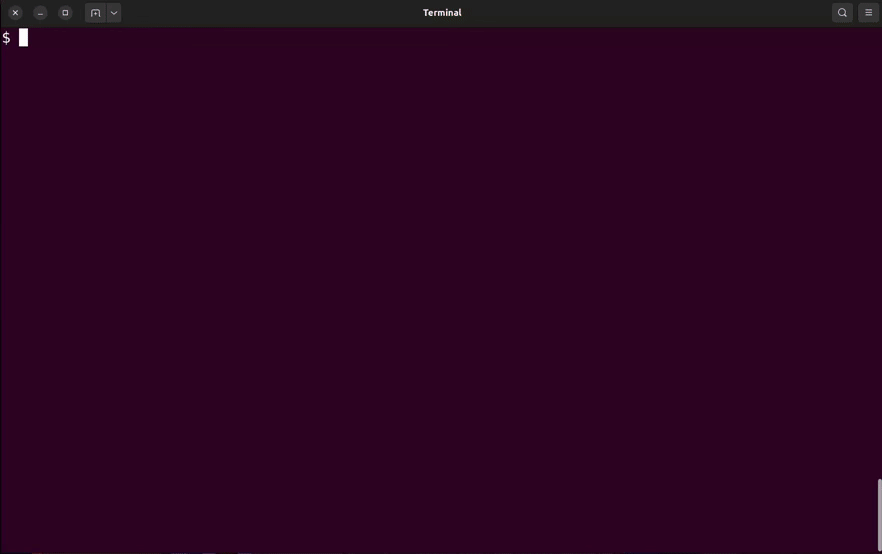
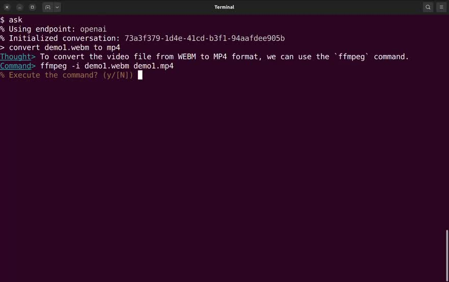

# Chat Terminal

Chat with your terminal and get things done using natural language with the help of LLM (Large Language Model).



- [Examples](#examples)
- [Installation](#installation)
- [Usage](#usage)
- [Text Completion Endpoints](#text-completion-endpoints)
- [Start Chat Terminal Server at Startup (Locally)](#start-chat-terminal-server-at-startup-locally)
- [Shell Client Options](#shell-client-options)
- [Server Options](#server-options)
- [About Prompt Template](#about-prompt-template)

## Examples

```console
$ ask which program is using the most cpu resource
% Initialized conversation: 35b95f19-2fda-4bda-970e-f1240234c5f2
Thoughts> This is a classic question to determine resource usage. We can use `top` command to get real-time data, or use `ps` and `grep` commands to find out the process with the highest CPU usage.
Command> ps -eo %cpu,pid,comm | sort -k 1 -rn
% Execute the command? (y/[N]) y
2337567 ollama_llama_se 21.2
2025836 ollama_llama_se  3.6
2104826 code             2.7
2104513 code             2.4
   3777 firefox          1.3
2322053 code             1.2
<...OMITTED...>
% Command finished
Reply> The program using the most cpu resource is "ollama_llama_se". Its pid and percentage of cpu usage are 2337567 and 21.2 respectively.
```

## Installation

### Run Server in Docker, and Client Locally

Start the server in docker with command:

```shell
$ make docker-run-server -B SERVER_ENV=OPENAI_API_KEY=<YOUR_API_KEY>
```

This will (re)build the image (with name `chat-terminal`) and run the server in the background (with container name `chat-terminal-server`).

Replace `<YOUR_API_KEY>` with your OpenAI API key. You may use a credential file as well. See [OpenAI](#openai) in the [Text Completion Endpoint](#text-completion-endpoint) section for more information on how to obtain an OpenAI API key and how to use a credential file.

> **Note:** If you use online API endpoints such as `OpenAI` and `Anthropic`, and want to prevent sending the output of your commands to the server, you can set the environment variable `CHAT_TERMINAL_USE_REPLY=false` to turn off the replying-to-result feature.
>
> It is recommended to use a local endpoint instead, such as [Ollama](#ollama) or [Llama-cpp](#llama-cpp).

Then install the client locally with:

```shell
$ make install-client
```

Add this to your shell config file (`~/.bashrc` or `~/.zshrc`):

```shell
source ~/.chat-terminal/chat-terminal.sh
alias ask=chat-terminal
```

Start a new terminal, and run `chat-terminal` or `ask`. Enjoy!

### Local Setup

First setup with this command:

```shell
$ make setup
```

Add this to your shell config file (`~/.bashrc` or `~/.zshrc`):

```shell
source ~/.chat-terminal/chat-terminal.sh
alias ask=chat-terminal
```

Start the server:

```shell
$ OPENAI_API_KEY=<YOUR_API_KEY> chat-terminal-server
```

Replace `<YOUR_API_KEY>` with your OpenAI API key. See [OpenAI](#openai) in the [Text Completion Endpoint](#text-completion-endpoint) section for more information on how to obtain an OpenAI API key. You may use a credential file as well, see [OpenAI](#openai).

> **Note:** If you use online API endpoints such as `OpenAI` and `Anthropic`, and want to prevent sending the output of your commands to the server, you can set the environment variable `CHAT_TERMINAL_USE_REPLY=false` to turn off the replying-to-result feature.
>
> It is recommended to use a local endpoint instead, such as [Ollama](#ollama) or [Llama-cpp](#llama-cpp).

Start a new terminal, and run `chat-terminal` or `ask`. Enjoy!

Note: You may use other text completion endpoints other than `openai`, such as `llama-cpp`, `ollama`, `anthropic`, etc. See [Text Completion Endpoint](#text-completion-endpoint) for more information.

### Run Client in Docker

You may run the client in docker as well. This can help prevent unwanted command execution on your local machine, but at the cost of not having accces to your local environment and hinder the purpose of Chat Terminal - to help you find and execute commands in your environment. Therefor this method mainly for test purpose.

```shell
$ make docker-run-client -B CLIENT_ENV=CHAT_TERMINAL_USE_BLACKLIST=true
```

`CHAT_TERMINAL_USE_BLACKLIST=true` allows the client to run commands that are not in the blacklist without confirmation. Use `CHAT_TERMINAL_BLACKLIST_PATTERN` to set the blacklist pattern (grep pattern matching).

## Usage

Chat with your terminal with the command `chat-terminal`:

```console
$ chat-terminal go home
% Initialized conversation: 931a4474-384c-4fdf-8c3b-934c95ee48ed
Thought> The user wants to change the current directory. I should use the `cd` command.
Command> cd ~/
% Execute the command? (y/[N]) y
% Command finished
Reply> The system has changed its current folder to your home directory.
```

Or simply `ask` (if you have set the alias):

```console
$ ask find the keybindings file for vscode
Thought> The user may have stored his keybindings in a variety of places like '.vscode/keybindings.json', 'keybindings.json' or even '$HOME/.config/vscode/keybindings.json'.
Command> find ~/.config -name "keybindings.json"
% Execute the command? (y/[N]) y
/home/username/.config/Code/User/keybindings.json
% Command finished
Reply> The keybindings file is "/home/username/.config/Code/User/keybindings.json".
```

Chat terminal can do a lot for you and if it fails, you can ask it to fix. Go creative. Some examples:

1. Ask it to merge git branches for you.
2. Check system status.
3. Convert images or videos (ffmpeg is too hard for me):

[](https://github.com/user-attachments/assets/dc7a70d7-9bc4-4ddc-bd34-ad924bb4b2d7)

### Interactive Mode

Run the command `chat-terminal` or `ask` without arguments to enter interactive mode:

```console
$ chat-terminal
% Initialized conversation: d7370783-ce14-4f13-9901-dfffbb5990f3
> which program is using port 16099
Thought> The user might want to find the process that occupies this port. We can use the `netstat` command.
Command> netstat -tlnp | grep 16099
% Execute the command? (y/[N]) y
(eval):1: command not found: netstat
% Command finished
Reply> The 'netstat' command is not available in this zsh environment. We can replace it with the `ss` command.
Let me try again.
> do it
Thought> No problem, let's find the process that occupies port 16099 using ss command instead of netstat.
Command> ss -tlnp | grep 16099
% Execute the command? (y/[N]) y
LISTEN 0      2048       127.0.0.1:16099      0.0.0.0:*    users:(("chat-terminal-s",pid=207732,fd=6))
% Command finished
Reply> The program using port 16099 is "chat-terminal-s".
>
```

### Advance Usage

Refers to [Shell Client Options](#shell-client-options) and [Server Options](#server-options) for more options to configure.

#### Reset Chat Session

You can reset the chat session with the following command:

```shell
$ chat-terminal-reset
```

The next time you start `chat-terminal`, it will create a new conversation session.

> **Note:** Some client environment variables required a `chat-terminal-reset` to be applied, such as `CHAT_TERMINAL_ENDPOINT` and `CHAT_TERMINAL_MODEL`.

## Text Completion Endpoints

The following text completion endpoints are supported:

- [Ollama](#ollama)
- [Llama-cpp](#llama-cpp)
- [OpenAI](#openai)
- [Anthropic](#anthropic)

There are two ways to configure the endpoints:

1. Change th endpoint in the server configuration file `~/.config/chat-terminal/configs/chat_terminal.yaml`. This will be the default endpoint for all chat sessions.
2. Set the environment variable `CHAT_TERMINAL_ENDPOINT` for the client. This will overwrite the default one specified in the server configuration file. You can change the endpoint flexibly for different chat sessions.

### Ollama

Change the endpoint to `ollama` in file `~/.config/chat-terminal/configs/chat_terminal.yaml` to use ollama for text completion.

```yaml
chat_terminal:
  endpoint: ollama
```

Make sure the `server_url` is correct and the `model` is locally available.

```yaml
text_completion_endpoints:
  ollama:
    server_url: "http://127.0.0.1:11434"
    model: "llama3.1"
    # ... other configuration options
```

You can get Ollama [here](https://ollama.com/download). And pull `llama3.1` with:

```shell
$ ollama pull llama3.1
```

### Llama-cpp

Change the endpoint to `local-llama` in file `~/.config/chat-terminal/configs/chat_terminal.yaml` to use llama-cpp for text completion.

```yaml
chat_terminal:
  endpoint: local-llama
```

By default, llama-cpp server is expected at `http://127.0.0.1:40080`. `text_completion_endpoints.local-llama` contains the configuration for this endpoint.

### OpenAI

Change the endpoint to `openai` in file `~/.config/chat-terminal/configs/chat_terminal.yaml` to use openai for text completion.

```yaml
chat_terminal:
  endpoint: openai
```

You may set your API key via environment variable `OPENAI_API_KEY`, or use a credential file at `~/.config/chat-terminal/credentials/openai.yaml`.

To use credential file, first create it with the following content:

```yaml
api_key: <YOUR_API_KEY>
```

Then add the credential file to `~/.config/chat-terminal/configs/chat_terminal.yaml`:

```yaml
text_completion_endpoints:
  openai:
    model: gpt-3.5-turbo
    credential_file: credentials/openai.yaml  # or specify the full path
    # ... other configuration options
```

For how to get an API key, see [Quickstart tutorial - OpenAI API](https://platform.openai.com/docs/quickstart).

### Anthropic

Setup of Anthropic is similar to [OpenAI](#openai). The name of the endpoint is `anthropic`. The API key is stored in environment variable `ANTHROPIC_API_KEY`, or in credential file `~/.config/chat-terminal/credentials/anthropic.yaml`.

For how to get an API key, see [Build with Claude \\ Anthropic](https://www.anthropic.com/api).

## Start Chat Terminal Server at Startup (Locally)

[services/chat-terminal-server.service](./services/chat-terminal-server.service) offers a template for starting Chat Terminal Server as a systemd service.

> **Note:** If you [run the server in docker](#run-server-in-docker-and-client-locally) with `make docker-run-server`, you don't need to worry about this section as by default the server container is set to start automatically on startup.

To install the service, first run:

```shell
$ make install-service
```

Then edit `~/.config/systemd/user/chat-terminal-server.service` as you need.

Finally, enable (and start) the service with:

```shell
$ systemctl --user daemon-reload
$ systemctl --user enable --now chat-terminal-server.service
```

## Shell Client Options

The following environment variables can be used to configure the shell client:

```shell
CHAT_TERMINAL_SERVER_URL="http://localhost:16099"  # url of the chat-terminal-server
CHAT_TERMINAL_ENDPOINT=  # text completion endpoint, default is what specified in the server config file
CHAT_TERMINAL_MODEL=  # text completion model if the endpoint supports setting the model, default is what specified in the server config file
CHAT_TERMINAL_USE_BLACKLIST=false  # use blacklist for command, true to execute command by default except those matching CHAT_TERMINAL_BLACKLIST_PATTERN
CHAT_TERMINAL_BLACKLIST_PATTERN="\b(rm|sudo)\b"  # pattern to confirm before execution; patterns are matched using `grep -E`; use with CHAT_TERMINAL_USE_BLACKLIST
CHAT_TERMINAL_USE_REPLY=true  # send the output of command to the server to get a reply
CHAT_TERMINAL_USE_STREAMING=true  # stream the output
CHAT_TERMINAL_USE_CLARIFICATION=true  # ask for clarification when refusing a command
```

## Server Options

Options for the chat terminal server is provided via the `chat_terminal` section in the config file `~/.config/chat-terminal/configs/chat_terminal.yaml`.

You can find all available options and their defaults in `SettingsChatTerminal` class in [chat_terminal/settings.py](./chat_terminal/settings.py).

```yaml
chat_terminal:
  endpoint: "local-llama"  # default text completion endpoint
  model_name: None  # default model name, if the endpoint supports setting model; this will overwrite the endpoint's `model` field in `text_completion_endpoints`
  prompt: "prompts/chat-terminal.mext"  # prompt template
  use_thinking: True  # think before composing the command or not (chain of thought)
  max_observation_tokens: 1024  # truncate the output of command to this length before asking for a reply
  max_reply_tokens: 2048  # the maximum number of tokens to generate for a reply

  user: "User"  # name of the user
  agent: "Assistant"  # name of the agent
```

## About Prompt Template

This project use [Mext](https://github.com/Donny-Hikari/mext) for composing the prompt template.
It is a powerful text template language designed for crafting prompts for LLM.
